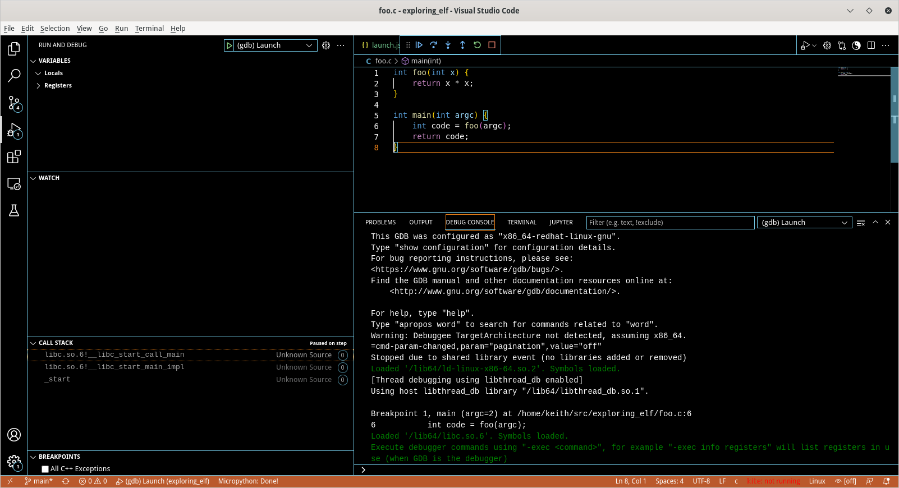

# Exploring ELF
An exploration of the Executable Link Format (ELF) 

Multiple examples from the article at [https://werat.dev/blog/how-wine-works-101/][https://werat.dev/blog/how-wine-works-101/]

Working on examples from [https://developer.ibm.com/tutorials/l-dynamic-libraries/][https://developer.ibm.com/tutorials/l-dynamic-libraries/] article 

